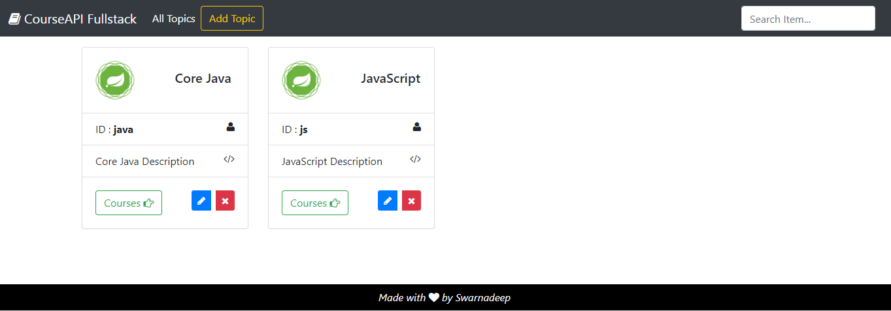
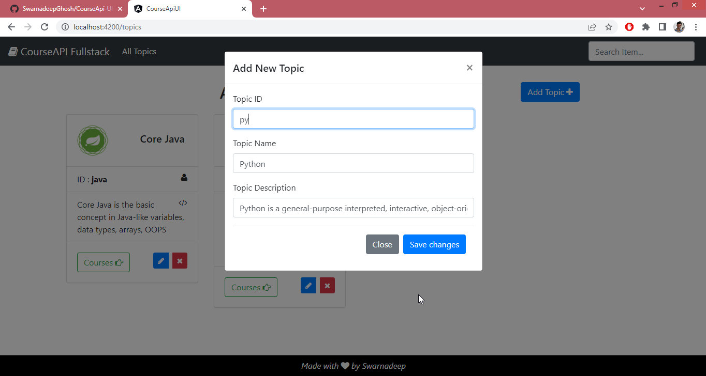
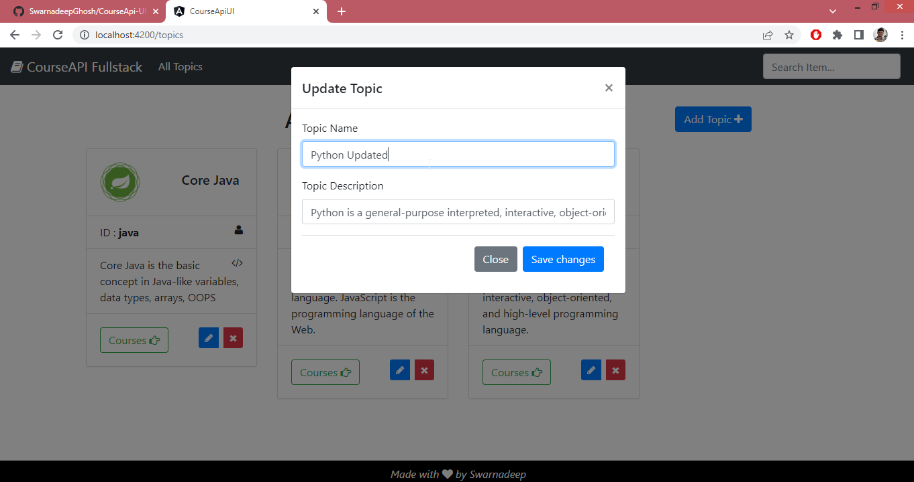
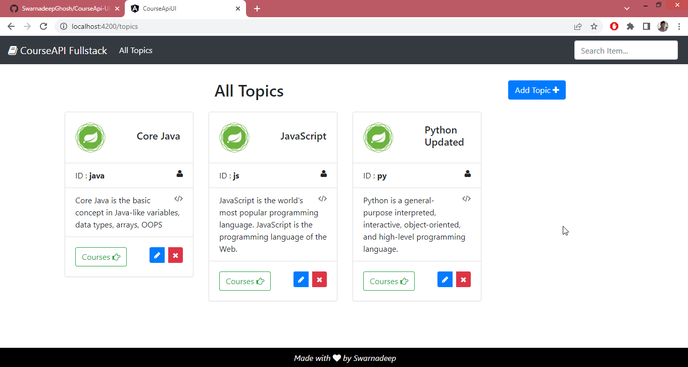
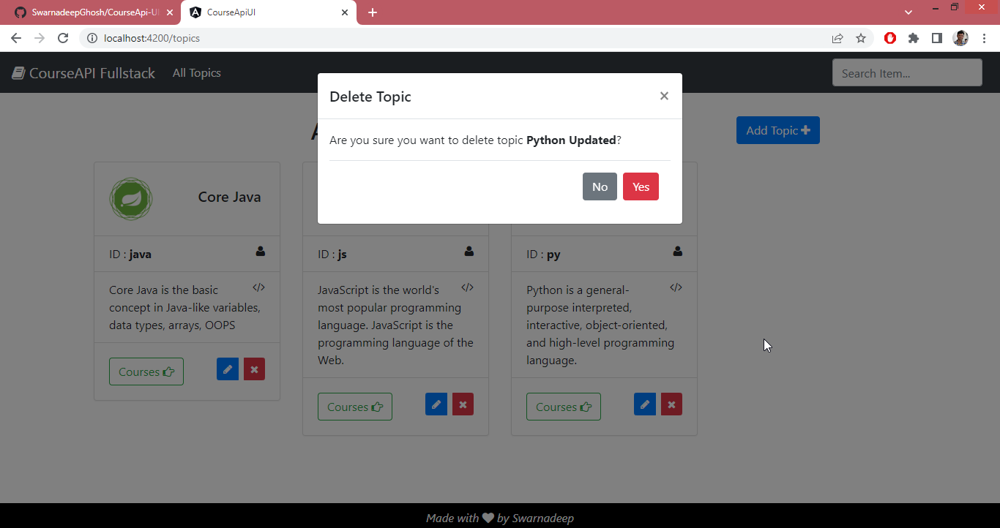
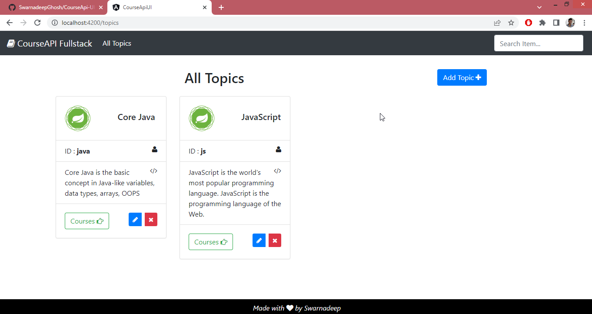

# CourseApi Frontend StepByStep Tutorial

This project was generated with [Angular CLI](https://github.com/angular/angular-cli) version 13.3.5.


## Setup 

```sh
$ ng new TodoList
$ cd Todolist
$ npm install bootstrap
$ npm install jquery
-- Downloaded versions: "bootstrap": "^4.6.1", "jquery": "^3.6.0",

We will use 
```

We will use [Bootdey - bs4 contact cards](https://www.bootdey.com/snippets/view/bs4-contact-cards) to design our frontend.


Configure `angular.json` to activate bootstrap and jquery

```json
"architect": {
    "build": {
        "builder": "@angular-devkit/build-angular:browser",
        "options": {
            "outputPath": "dist/course-api-ui",
            "index": "src/index.html",
            "main": "src/main.ts",
            "polyfills": "src/polyfills.ts",
            "tsConfig": "tsconfig.app.json",
            "assets": [
                "src/favicon.ico",
                "src/assets"
            ],
            "styles": [
                "src/styles.css",
                "./node_modules/bootstrap/dist/css/bootstrap.min.css"
            ],
            "scripts": [
                "./node_modules/jquery/dist/jquery.min.js",
                "./node_modules/bootstrap/dist/js/bootstrap.js"
            ]
        },
```


### Backend Cors Config

***application.properties***

```proper
frontendURL=http://localhost:4200
# frontendURL=
```

**`CourseAPI-Spring-Starter\src\main\java\com\swarna\courseapi\config\CorsConfig.java`**

```java
package com.swarna.courseapi.config;
import org.springframework.beans.factory.annotation.Value;
import org.springframework.context.annotation.Configuration;
import org.springframework.web.servlet.config.annotation.CorsRegistry;
import org.springframework.web.servlet.config.annotation.WebMvcConfigurer;

@Configuration
public class CorsConfig implements WebMvcConfigurer{

    @Value("${frontendURL}")
	private String frontendURL;

    @Override
    public void addCorsMappings(CorsRegistry registry) {
        // WebMvcConfigurer.super.addCorsMappings(registry);
        registry.addMapping("/**").allowedOrigins(frontendURL)
        .allowedMethods("GET", "POST", "PUT", "DELETE", "OPTIONS");
    }
}
```


### Setting up Environments

***environment.ts***

```typescript
export const environment = {
  production: false,
  apiServerUrl : 'http://localhost:8080' // baseUrl is the URL for backend
};
```

***environment.prod.ts***

```typescript
export const environment = {
  production: false,
  apiServerUrl : 'https://courseapi-spring-boot.herokuapp.com' // apiServerUrl is the URL for backend
};
```


Adding `HttpClientModule` to ***app.module.ts***, so that it can fetch data from backend.

```typescript
import { HttpClientModule } from '@angular/common/http'
...
  imports: [
    BrowserModule,
    AppRoutingModule,
    HttpClientModule,
  ],
...
```

### Routing Module

***app-routing.module.ts*** - Used to fetch data from `TopicService` and send the data to HTML.

```typescript
import { NgModule } from '@angular/core';
import { RouterModule, Routes } from '@angular/router';
import { TopicComponent } from './components/topic/topic.component';

const routes: Routes = [
  { path: 'topics', component: TopicComponent },
];

@NgModule({
  imports: [RouterModule.forRoot(routes)],
  exports: [RouterModule]
})
export class AppRoutingModule { }
```


## Services

- Generate command : `ng g s services/Topic`

***topic.service.ts*** - To Extract **Topics** data from backend 

```typescript
import { HttpClient } from '@angular/common/http';
import { Injectable } from '@angular/core';
import { Observable } from 'rxjs';
import { environment } from 'src/environments/environment';
import { Topic } from '../models/Topic';

@Injectable({
  providedIn: 'root',
})
export class TopicService {
  constructor(private http: HttpClient) {}

  public getAllTopics(): Observable<Topic[]> {
    return this.http.get<Topic[]>(`${environment.apiServerUrl}/topics`);
  }

  public addTopic(topic: Topic): Observable<Topic> {
    return this.http.post<Topic>(`${environment.apiServerUrl}/topics`, topic);
  }

  public updateTopic(topic: Topic, topicId: string): Observable<Topic> {
    return this.http.put<Topic>(`${environment.apiServerUrl}/topics/${topicId}`, topic);
  }

  public deleteTopic(topicId: string): Observable<void> {
    return this.http.delete<void>(`${environment.apiServerUrl}/topics/${topicId}`);
  }
}
```


## Models

***Topic.ts*** - Topic Interface

```typescript
export interface Topic{
    id: string;
    name: string;
    description: string;
}
```


## Components

### Navbar - Footer

***app.component.html***

```html
<nav class="navbar navbar-expand-lg navbar-dark bg-dark">
    <a class="navbar-brand" routerLink="/"><i class="fa fa-book"></i> CourseAPI Fullstack</a>
    <button class="navbar-toggler" type="button" data-toggle="collapse" data-target="#navbarSupportedContent" aria-controls="navbarSupportedContent" aria-expanded="false" aria-label="Toggle navigation">
      <span class="navbar-toggler-icon"></span>
    </button>
  
    <div class="collapse navbar-collapse" id="navbarSupportedContent">
      <ul class="navbar-nav mr-auto">
        <li class="nav-item active">
          <a class="nav-link" routerLink="/topics">All Topics <span class="sr-only">(current)</span></a>
        </li>
      </ul>
      <form class="form-inline my-2 my-lg-0">
        <input class="form-control mr-sm-2" type="search" placeholder="Search Item..." aria-label="Search">
      </form>
    </div>
</nav>

<div class="my-3">
    <router-outlet></router-outlet>
</div>

<footer class="footer text-light">
  <div class="footer-container align-middle text-center">
      <i>Made with <i class="fa fa-heart"></i> by <a class="text-light" href="https://swarnadeepghosh.github.io/">Swarnadeep</a></i>
  </div>
</footer>
```

***app.component.css***

```css
.footer{
    position: fixed;
    bottom: 0;
    width: 100%;
    height: 40px;
    background-color: #000000;
}
.footer-container{
    padding: 8px;
}
```


### Topic Comp- GET all Topics

- Generate command : `ng g c components/Topic`

- Open [Bootdey - bs4 contact cards](https://www.bootdey.com/snippets/view/bs4-contact-cards) and copy HTML and CSS in appropriate place.

- app-***routing.module.ts***

  ```typescript
  const routes: Routes = [
    { path: '', redirectTo: '/topics', pathMatch: 'full' },
    { path: 'topics', component: TopicComponent },
    { path: '**', component: ErrorComponent },
  ];
  ```

  

- ***topic.component.html*** - Copy HTML from Bootdey to here, and added for loop, so that 

  ```html
  <!-- <link href="https://maxcdn.bootstrapcdn.com/font-awesome/4.3.0/css/font-awesome.min.css" rel="stylesheet"> -->
  <div class="container">
      
      <div class="row">
          <div class="col-md-8 my-3 text-center">
              <h2>All Topics</h2>
          </div>
          <div class="col-md-4 my-3 text-center">
              <a class="btn mx-2 btn-primary" data-placement="top" data-original-title="Add"> Add Topic <i class="fa fa-plus"></i> </a>
          </div>
      </div>
      
      <div class="row">
          <div *ngFor="let topic of topics" class="col-md-6 col-xl-3">
              <div class="card m-b-30">
                  <div class="card-body row">
                      <div class="col-6">
                          <a href=""></a>
                      </div>
                      <div class="col-6 card-title align-self-center mb-0">
                          <h5>{{topic.name}}</h5>
                          <!-- <p class="m-0">ID : {{topic.id}}</p> -->
                      </div>
                  </div>
                  <ul class="list-group list-group-flush">
                      <!-- <li class="list-group-item"><i class="fa fa-envelope float-right"></i>Email : <a href="#">PaulGoyette@gmail.com</a></li> -->
                      <li class="list-group-item"><i class="fa fa-user float-right"></i>ID : <strong>{{topic.id}}</strong></li>
                      <li class="list-group-item"><i class="fa fa-code float-right"></i>{{topic.description}}</li>
                  </ul>
                  <div class="card-body">
                      <div class="float-right btn-group btn-group-sm">
                          <a href="#" class="btn mx-2 btn-primary tooltips" data-placement="top" data-toggle="tooltip" data-original-title="Edit"><i class="fa fa-pencil"></i> </a>
                          <a href="#" class="btn btn-danger tooltips" data-placement="top" data-toggle="tooltip" data-original-title="Delete"><i class="fa fa-times"></i></a>
                      </div>
                      <ul class="social-links list-inline mb-0">
                          <button type="button" class="btn btn-outline-success list-inline-item">Courses <i class="fa fa-hand-o-right"></i></button>
                          <!-- <li class="list-inline-item"><a title="" data-placement="top" data-toggle="tooltip" class="tooltips" href="" data-original-title="Facebook"><i class="fa fa-facebook-f"></i></a></li>
                      </ul>
                  </div>
              </div>
          </div>
  
      </div>
  
      <!-- Notification for NO item -->
      <div *ngIf="topics?.length == 0" class="col-lg-12 col-md-12 col-xl-12">
          <div class="alert alert-info" role="alert">
              <h4 class="alert-heading">NO TOPICS !!</h4>
              <p>No Topics were found.</p>
          </div>
      </div>
  </div>
  ```


- ***styles.css*** - Copy CSS from Bootdey to here.

  ```css
  /* You can add global styles to this file, and also import other style files */
  /* @import url('https://cdn.jsdelivr.net/npm/bootstrap@4.6.1/dist/css/bootstrap.min.css'); */
  @import url('https://maxcdn.bootstrapcdn.com/font-awesome/4.3.0/css/font-awesome.min.css');
  
  body{
      margin-top:20px;
      background: #ebebeb;
      background-color: #d1d1d1;
  }
  .card {
      border: none;
      -webkit-box-shadow: 0 1px 2px 0 rgba(0,0,0,.05);
      box-shadow: 0 1px 2px 0 rgba(0,0,0,.05);
      margin-bottom: 30px;
  }
  .w-60 {
      width: 60px;
  }
  h1, h2, h3, h4, h5, h6 {
      margin: 0 0 10px;
      font-weight: 600;
  }
  .social-links li a {
      -webkit-border-radius: 50%;
      background-color: rgba(89,206,181,.85);
      border-radius: 50%;
      color: #fff;
      display: inline-block;
      height: 30px;
      line-height: 30px;
      text-align: center;
      width: 30px;
      font-size: 12px;
  }
  a {
      color: #707070;
  }
  ```


- ***topic.component.ts*** - Used to fetch data from `TopicService` and send the data to HTML.

  ```typescript
  import { HttpErrorResponse } from '@angular/common/http';
  import { Topic } from 'src/app/models/Topic';
  import { TopicService } from 'src/app/services/topic.service';
  ...
  export class TopicComponent implements OnInit {
    public topics: Topic[] = [];
  
    constructor(private topicService: TopicService) {}
  
    ngOnInit(): void {
      this.getTopics();
    }
  
    public getTopics(): void {
      this.topicService.getAllTopics().subscribe(
        (response: Topic[]) => { this.topics = response;  }, 
        (error: HttpErrorResponse) => { console.log(error.message); }
      );
    }
  }
  ```


**Snapshot after adding Header, Footer and Get all Topics**




### Modal Addition in Topic

- **index.html** - Popper js will be required for Modals 

    ```html
     <script src="https://cdnjs.cloudflare.com/ajax/libs/popper.js/1.12.9/umd/popper.min.js"></script>
    ```

- ***topic.component.ts*** - `onOpenModal()` will be called for each Add/ Update/ Delete operation and this will decide which Modal to choose as per `data-target`.

    ```typescript
    public updateTopic: Topic;
    public deleteTopic: Topic;
    
    public onOpenModal(topic: Topic, mode: string): void {
        const container = document.getElementById('main-container');
    
    // Basically we will create below button through JavaScript
    //<button type="button" class="btn btn-primary" data-toggle="modal" data-target="#exampleModal">Launch modal</button>
    const button = document.createElement('button');
    button.type = 'button'; // To change default button type from Submit.
    button.style.display = 'none'; // Hide the button in UI, we will use already created button for Add / delete / update
    button.setAttribute('data-toggle', 'modal');
    
    // Setting data Target as per mode
    if (mode === 'add') {
        button.setAttribute('data-target', '#addTopicModal');
        console.log('Add called');
    }
    if (mode === 'update') {
        this.updateTopic = topic;
        button.setAttribute('data-target', '#updateTopicModal');
        console.log('Update called');
    }
    if (mode === 'delete') {
        this.deleteTopic = topic;
        button.setAttribute('data-target', '#deleteTopicModal');
        console.log('delete called');
    }
    
    container?.appendChild(button); // Adding the button to the view, so that it can do its job
    button.click();
    }
    ```

- ***topic.component.html*** - calling `onOpenModal()`, which will decide which Modal to choose as per `data-target`.

    ```html
    <!-- Buttons from where onOpenModal() will be called-->
    <a (click)="onOpenModal(null, 'add')" class="btn mx-2 btn-primary" data-placement="top" data-original-title="Add"> Add Topic <i class="fa fa-plus"></i> </a> ... 
    <a (click)="onOpenModal(topic, 'update')" class="btn mx-2 btn-primary tooltips" data-placement="top" data-original-title="Edit"><i class="fa fa-pencil"></i> </a> ...
    <a (click)="onOpenModal(topic, 'delete')" class="btn btn-danger tooltips" data-placement="top" data-original-title="Delete"><i class="fa fa-times"></i></a> ...
    
    <!-- Modals -->
    <div class="modal fade" id="addTopicModal" tabindex="-1" role="dialog" aria-labelledby="addModalLabel" aria-hidden="true"> ... </div>
    <div class="modal fade" id="updateTopicModal" tabindex="-1" role="dialog" aria-labelledby="updateModalLabel" aria-hidden="true"> ... </div>
    <div class="modal fade" id="deleteTopicModal" tabindex="-1" role="dialog" aria-labelledby="deleteModalLabel" aria-hidden="true"> ... </div>
    ```

- **app.module.ts** - Adding `FormsModule` for Modals

  ```typescript
  import { FormsModule } from '@angular/forms';
  imports: [
  	...
      FormsModule
  ],
  ```


### ADD Modal for Topic

***topic.component.ts***

```typescript
  public onAddTopic(addForm: NgForm): void {
    document.getElementById('add-topic-form').click(); // This will close add modal after submit
    this.topicService.addTopic(addForm.value).subscribe(
      (response: Topic) => {
        console.log(response);
        this.getTopics();
        addForm.reset();
      },
      (error: HttpErrorResponse) => {
        alert(error.message);
        addForm.reset();
      }
    );
  }
```

***topic.component.html***

```html
<!-- ADD Item Modal-->
<div class="modal fade" id="addTopicModal" tabindex="-1" role="dialog" aria-labelledby="addModalLabel"aria-hidden="true">
    <div class="modal-dialog" role="document">
        <div class="modal-content">
            <div class="modal-header">
                <h5 class="modal-title" id="addModalLabel">Add New Topic</h5>
                <button type="button" class="close" data-dismiss="modal" aria-label="Close">
                    <span aria-hidden="true">&times;</span>
                </button>
            </div>
            <div class="modal-body">
                <form #addForm="ngForm" (ngSubmit)="onAddTopic(addForm)">
                    <div class="form-group">
                        <label for="id">Topic ID</label>
                        <input type="text" ngModel name="id" class="form-control" id="id" placeholder="Enter Topic ID..." required>
                    </div>
                    <div class="form-group">
                        <label for="name">Topic Name</label>
                        <input type="text" ngModel name="name" class="form-control" id="name" placeholder="Enter Topic name..." required>
                    </div>
                    <div class="form-group">
                        <label for="description">Topic Description</label>
                        <input type="text" ngModel name="description" class="form-control" id="description" placeholder="Enter Topic description..." required>
                    </div>
                    <div class="modal-footer">
                        <button type="button" id="add-topic-form" class="btn btn-secondary" data-dismiss="modal">Close</button>
                        <button [disabled]="addForm.invalid" type="submit" class="btn btn-primary">Save changes</button>
                    </div>
                </form>
            </div>
        </div>
    </div>
</div>
```

**Snapshot of Add Topic Modal**




### UPDATE Modal for Topic

***topic.component.ts***

```typescript
public onupdateTopic(topic: Topic): void {
    // document.getElementById('update-topic-form').click();
    this.topicService.updateTopic(topic, topic.id).subscribe(
        (response: Topic) => {
            console.log(response);
            this.getTopics();
        },
        (error: HttpErrorResponse) => {
            alert(error.message);
        }
    );
}
```

***topic.component.html***

```html
<!-- UPDATE Item Modal-->
<div class="modal fade" id="updateTopicModal" tabindex="-1" role="dialog" aria-labelledby="updateModalLabel" aria-hidden="true">
    <div class="modal-dialog" role="document">
        <div class="modal-content">
            <div class="modal-header">
                <h5 class="modal-title" id="updateModalLabel">Update Topic</h5>
                <button type="button" class="close" data-dismiss="modal" aria-label="Close">
                    <span aria-hidden="true">&times;</span>
                </button>
            </div>
            <div class="modal-body">
                <form #updateForm="ngForm">
                    <!-- Making Id hidden, so that users not able to update the id -->
                    <input type="hidden" ngModel="{{updateTopic?.id}}" name="id" class="form-control" id="id" placeholder="Enter Topic ID..." required>
                    <div class="form-group">
                        <label for="name">Topic Name</label>
                        <input type="text" ngModel="{{updateTopic?.name}}" name="name" class="form-control" id="name" placeholder="Enter Topic name..." required>
                    </div>
                    <div class="form-group">
                        <label for="description">Topic Description</label>
                        <input type="text" ngModel="{{updateTopic?.description}}" name="description" class="form-control" id="description" placeholder="Enter Topic description..." required>
                    </div>
                    <div class="modal-footer">
                        <button type="button" id="update-topic-form" class="btn btn-secondary" data-dismiss="modal">Close</button>
                        <button (click)="onupdateTopic(updateForm.value)" data-dismiss="modal" class="btn btn-primary" >Save changes</button>
                    </div>
                </form>
            </div>
        </div>
    </div>
</div>
```

**Snapshot of Update Topic Modal**






### DELETE Modal for Topic

***topic.component.ts***

```typescript
public onDeleteTopic(topicId: string): void {
    this.topicService.deleteTopic(topicId).subscribe(
        (response: void) => {
            console.log("Topic Deleted : " + topicId);
            this.getTopics();
        },
        (error: HttpErrorResponse) => { alert(error.message); }
    );
}
```

***topic.component.html***

```html
<!-- DELETE Item Modal-->
<div class="modal fade" id="deleteTopicModal" tabindex="-1" role="dialog" aria-labelledby="deleteModalLabel"
     aria-hidden="true">
    <div class="modal-dialog" role="document">
        <div class="modal-content">
            <div class="modal-header">
                <h5 class="modal-title" id="deleteModalLabel">Delete Topic</h5>
                <button type="button" class="close" data-dismiss="modal" aria-label="Close">
                    <span aria-hidden="true">&times;</span>
                </button>
            </div>
            <div class="modal-body">
                <p>Are you sure you want to delete topic <strong>{{deleteTopic?.name}}</strong>?</p>
                <div class="modal-footer">
                    <button type="button" class="btn btn-secondary" data-dismiss="modal">No</button>
                    <button (click)="onDeleteTopic(deleteTopic?.id)" class="btn btn-danger" data-dismiss="modal">Yes</button>
                </div>
            </div>
        </div>
    </div>
</div>
```

**Snapshot of Delete Topic Modal**






